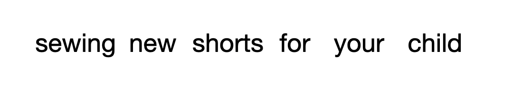

# Text Diffusion Models with SEDD

[](LICENSE)

This repo is based on the [Score Entropy Discrete Diffusion](https://github.com/louaaron/Score-Entropy-Discrete-Diffusion) repository. It contains a PyTorch implementation for the paper [Discrete Diffusion Modeling by Estimating the Ratios of the Data Distribution
](https://arxiv.org/abs/2310.16834) by [Aaron Lou](https://aaronlou.com), [Chenlin Meng](https://cs.stanford.edu/~chenlin/) and [Stefano Ermon](https://cs.stanford.edu/~ermon/).




It has been modified to perform character level diffusion for a few practical reasons.

1) Be able to run on a single A10 GPU
2) See how well a character level language diffusion model performs.


## Installation

Simply run

```
python -m venv ~/.venv_sedd
source ~/.venv_sedd/bin/activate
pip install -r requirements.txt
```

This will create a virtual environmet ```~/.venv_sedd``` environment with packages installed. 

Note that this installs with CUDA 11.8, and different CUDA versions must be installed manually. The biggest factor is making sure that the ```torch``` and ```flash-attn``` packages use the same CUDA version (more found [here](https://github.com/Dao-AILab/flash-attention)).

## Working with Pretrained Models

### Download Models

Our pretrained models are hosted on huggingface ([small](https://huggingface.co/louaaron/sedd-small), [medium](https://huggingface.co/louaaron/sedd-medium)). However, models can also be loaded in locally (say after training). All functionality is found in ```load_model.py```.

```
# load in a pretrained model
pretrained_small_model, graph, noise = load_model("louaaron/sedd-small")
pretrained_medium_model, graph, noise = load_model("louaaron/sedd-medium")
# load in a local experiment
local_model, graph, noise = load_model("exp_local/experiment)
```

This loading gives the model, as well as the graph and noise (which are used for the loss/sampling setup).

### Run Sampling

We can run sampling using a command 

```
python run_sample.py --model_path MODEL_PATH --steps STEPS
```

We can also sample conditionally using

```
python run_sample_cond.py --model_path MODEL_PATH --step STEPS --prefix PREFIX --suffix SUFFIX
```

## Training New Models

### Run Training

We provide training code, which can be run with the command

```
python run_train.py
```

## Citation
```
@article{lou2024discrete,
  title={Discrete diffusion modeling by estimating the ratios of the data distribution},
  author={Lou, Aaron and Meng, Chenlin and Ermon, Stefano},
  journal={arXiv preprint arXiv:2310.16834},
  year={2024}
}
```

## Acknowledgements

This repository builds heavily off of [Score Entropy Discrete Diffusion](https://github.com/louaaron/Score-Entropy-Discrete-Diffusion), [score sde](https://github.com/yang-song/score_sde_pytorch), [plaid](https://github.com/igul222/plaid), and [DiT](https://github.com/facebookresearch/DiT).